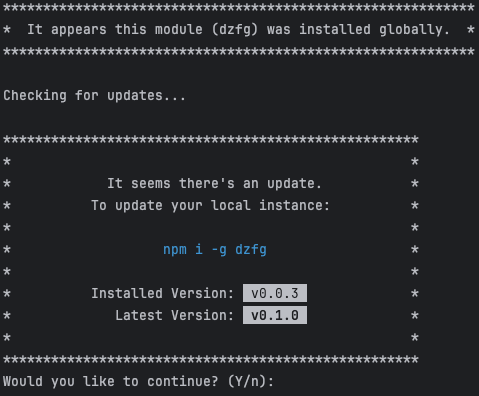

# DEPRECATED

To better align with the goal of this package, and make it a bit easier to find / use, I've decided to rename it to [`drfg` - Download Release From GitHub](https://www.npmjs.com/package/drfg).

# dzfg - Download Zipball From GitHub

[](https://www.npmjs.com/package/dzfg)
[](https://app.travis-ci.com/neonexus/dzfg)
[](https://www.npmjs.com/package/dzfg)
[](https://github.com/neonexus/dzfg)
[](https://github.com/neonexus/dzfg/blob/release/LICENSE)

The idea of this package, is to make downloading / extracting / installing a GitHub repo's latest release a breeze (without creating a new repo, or using Git for that matter). Both in the terminal, and programmatically, if you are into that kind of thing...

`npx dzfg <github-username/repo>`

## This works for ALMOST any GitHub repo...

As long as the repository is using [GitHub's releases](https://docs.github.com/en/repositories/releasing-projects-on-github/about-releases) feature, this script will work.

If a call to `https://api.github.com/repos/{username/repo}/releases/latest` returns a `tag_name` and `zipball_url`, then the script will download the zipball from `zipball_url`.

Additionally, if the repo contains a `package.json` after extraction, `npm install` will be run automatically, unless disabled. See [advanced usage](#a-little-more-advanced) for more.

## Table of Contents

* [Terminal Usage](#terminal-usage)
  * [Simple Usage](#simple-usage)
  * [A Little More Advanced](#a-little-more-advanced)
* [Installing `dzfg` Globally](#installing-dzfg-globally)
  * [Additional Script Names](#additional-script-names)
* [Programmatic Usage](#programmatic-usage)
  * [Advanced Usage](#advanced-usage)
  * [Getting Version Info for a Repo](#getting-version-info-for-a-repo)
  * [Don't Forget to Handle Errors...](#dont-forget-to-handle-errors)

## Terminal Usage

### Simple Usage

`npx dzfg <github-repo>`

OR

`npx dzfg <github-repo> <new-folder-name>`

For example, if you wanted to "clone" (download the zipball, and extract it) the repo [sails-react-bootstrap-webpack](https://github.com/neonexus/sails-react-bootstrap-webpack), just do something like:

```shell
npx dzfg neonexus/sails-react-bootstrap-webpack
```

This will download / extract / `npm install` the repo into a new folder `sails-react-bootstrap-webpack`. To change where the files get extracted to, add a second parameter to the command:

```shell
npx dzfg neonexus/sails-react-bootstrap-webpack my-new-site
````

This will extract into `my-new-site`, instead of the repo name.

### A Little More Advanced

If the repo contains a `package.json` in the root, but you don't want to `npm install` after extraction, just add `no-npm`:

`npx dzfg <github-repo> <no-npm?>`

**OR**

`npx dzfg <github-repo> <new-folder> <no-npm?>`

You can also provide a specific version to download / extract:

`npx dzfg <github-repo> <new-folder> <version?> <no-npm?>`

**NOTE:** When supplying a version, you **MUST** supply a folder name.

This will download `v4.2.3`, into the folder `my-new-site`, and will skip the `npm install` step:
```shell
npx dzfg neonexus/sails-react-bootstrap-webpack my-new-site v4.2.3 no-npm
```

## Installing `dzfg` Globally

```shell
npm i -g dzfg
```

You can install `dzfg` globally and run it directly (if you have your `$PATH` set correctly). This will save a small amount of time, as `npx` won't have to download and install, before running `dzfg`.
However, this also means you won't always be using the most up-to-date version of `dzfg` (GitHub may change their API, security issues may arise, etc.).

To help ensure you are always up-to-date, `dzfg` will use itself to check if there is an update, and if your current version doesn't match the latest version on GitHub, it will let you know.
This does **not** prevent you from using the version you already have installed, but it will ask you if you want to continue (you can simply hit enter).



### Additional Script Names

Once installed globally, you can use `dzfg` directly, with one of its few different binary names:

* `dzfg`
* `dl-zip-from-gh`
* `download-zip-from-gh`
* `download-zip-from-github`
* `download-zipball-from-gh`
* `download-zipball-from-github`

## Programmatic Usage

Using `.then()`:

```javascript
const dzfg = require('dzfg');

dzfg.downloadAndExtract('username/my-repo', 'new-folder').then((downloadInfo) => {});

// OR

dzfg.downloadAndExtract({
    repo: 'username/my-repo',
    destinationFolder: 'my-clone'
}).then((downloadInfo) => {});
```

Using `await`:
```javascript
const dzfg = require('dzfg');

const downloadInfo = await dzfg.downloadAndExtract('username/my-repo', 'new-folder');

// OR

const downloadInfo = await dzfg.downloadAndExtract({
    repo: 'username/my-repo',
    destinationFolder: 'my-clone'
});
```

`downloadInfo` will look something like:

```json5
{
    version: 'v1.0.1',
    downloadTime: '714.82 ms',
    extractionTime: '55.17 ms',
    installationTime: '2.75 s',
    totalTime: '3.61 s',
    zipballSize: '45.11 KiB',
    extractedSize: '146.73 KiB',
    installedSize: '19.45 MiB'
}
```

### Advanced usage

```javascript
const dzfg = require('dzfg');

// Parameters are: destination-folder, repo, version, skipNpmInstall
const downloadInfo = await dzfg.downloadAndExtract('username/my-repo', 'new-folder', 'v1.0.1', true);

// OR
const downloadInfo = await dzfg.downloadAndExtract({
    repo: 'username/my-repo',
    version: 'v1.0.1',
    skipInstall: true,
    destinationFolder: 'my-clone'
});
```

### Getting Version Info for a Repo

```javascript
const dzfg = require('dzfg');

const latestVersionInfo = await dzfg.getVersionInfo('username/my-repo');

// OR

dzfg.getVersionInfo('username/my-repo').then((latestVersionInfo) => {
    // Do stuff with the info...
});
```

`latestVersionInfo` will look something like:

```json5
{
    name: 'v1.0.1 (2023-10-01)',
    description: 'The version description body. This will likely contain markdown.',
    version: 'v1.0.1',
    isDraft: false,
    isPrerelease: false,
    createdAt: '2023-10-01T04:19:00Z',
    publishedAt: '2023-10-01T04:19:00Z',

    // `userSite` is the HTML URL for human use:
    userSite: 'https://github.com/{username/repo}/releases/tag/v1.0.1',

    // `zipball` is the URL dzfg will use internally to download the repo:
    zipball: 'https://api.github.com/repos/{username/repo}/zipball/v1.0.1'
}
```

Get info for a specific version:

```javascript
const dzfg = require('dzfg');

const latestVersionInfo = await dzfg.getVersionInfo('username/my-repo', 'v1.0.1');
```

### Don't Forget to Handle Errors...

```javascript
const dzfg = require('dzfg');

dzfg.downloadAndExtract('username/my-repo', 'new-folder')
    .then((successMessage) => {})
    .catch((e) => {});

dzfg.getVersionInfo('username/my-repo')
    .then((latestVersionInfo) => {})
    .catch((e) => {});

// OR

try {
    const downloadInfo = await dzfg.downloadAndExtract('username/my-repo', 'new-folder');
} catch (e) {
    // Display the error...
}

try {
    const latestVersionInfo = await dzfg.getVersionInfo('username/my-repo');
} catch (e) {
    // Display the error...
}
```
